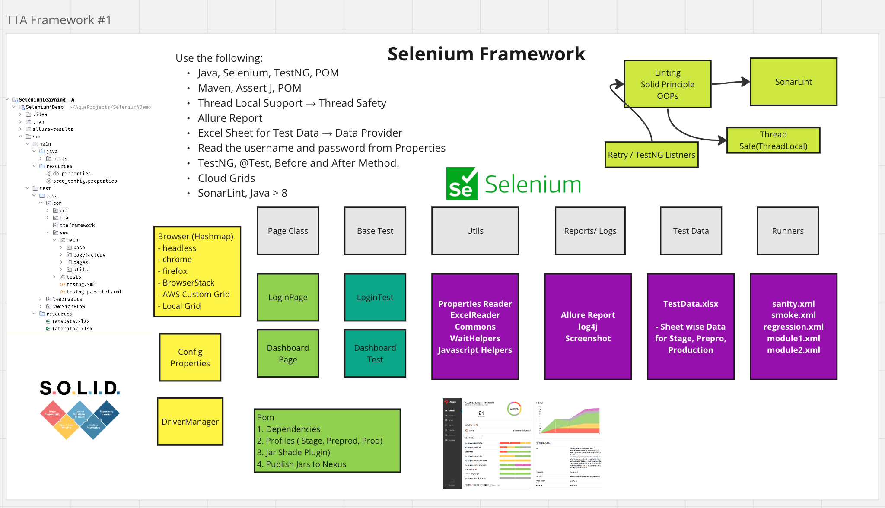
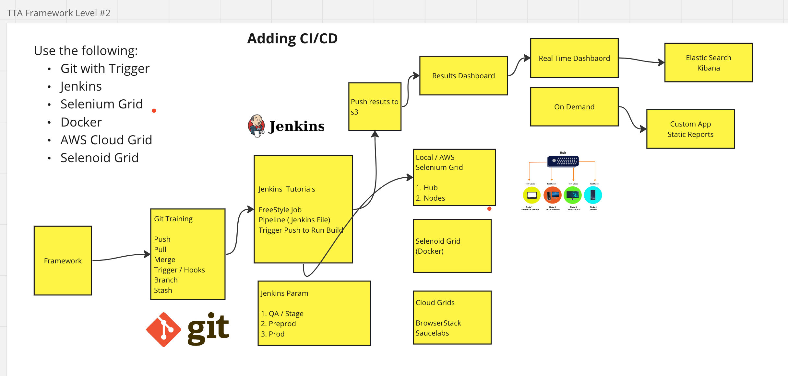
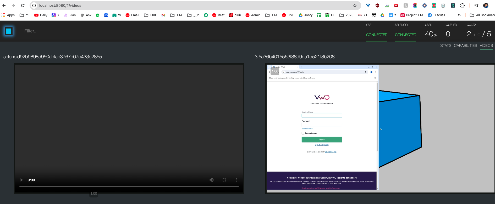

# Selenium Automation Framework(with Java)

Author - Mayank Paliwal

- Java, Selenium, TestNG
- Maven, AssertJ, POM
- Thread Local Support → Thread Safety
- Allure Report
- Excel Sheet for Test Data → Data Provider
- Read the username and password from Properties-
- TestNG, @Test, Before and After Method.
- Cloud Grids - Selenoid Docker integration
- SonarLint, Java > 8
- Run Local and on Selenoid Integration

`mvn test -Dsurefire.suiteXmlFiles=testng.xml`

### Seleniod - Docker Grid Running
- Selenoid is a powerful tool for running Selenium tests in Docker containers.
- which can help you manage and scale your test automation infrastructure more efficiently.

[//]: # (![Screenshot 2024-06-13 at 15 56 21]&#40;https://github.com/PramodDutta/ATB5xWebAutomationFramework/assets/1409610/3c957a88-8cf5-4e3c-9134-9fd41fd41d9b&#41;)
